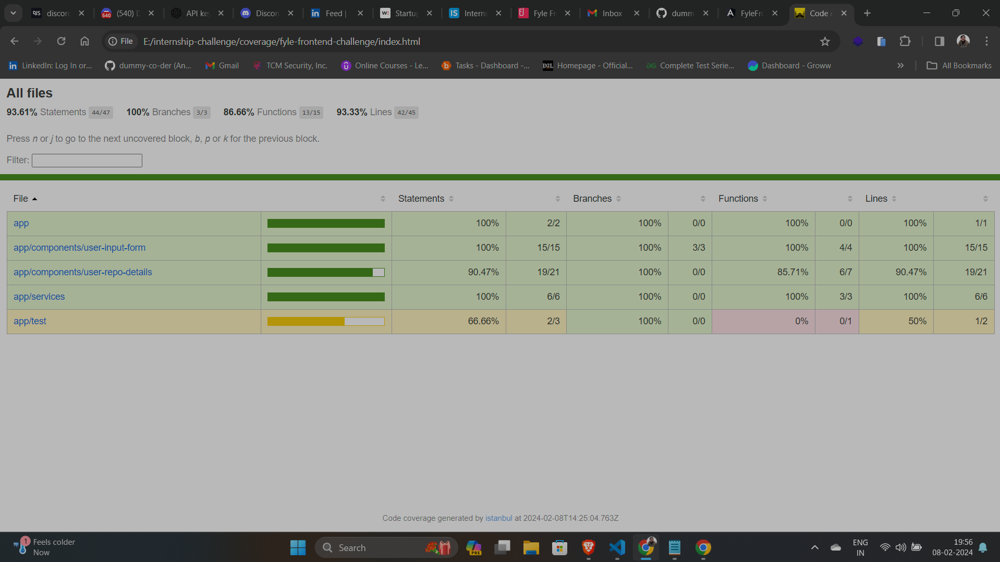

# Fyle Frontend Challenge
This is an Angular application built with TypeScript and managed with npm. The project structure is organized with a focus on modularity and scalability.

## Snapshots


<br>
<div align="center">
  
  
</div>

## Features
- **SCSS Styling:** The components in this project are styled using SCSS.
- **Toastr Notifications:** The project uses the ngx-toastr library for displaying notifications.
- **Spinner Animations:** The project uses the ngx-spinner library for displaying loading animations.
- **Pagination:** The project uses ngx-pagination, a library for Angular applications that provides pagination functionality.
- **RxJS:** This project uses the rxjs for composing asynchronous and event-based programs by using operators to manipulate streams of data.

## Setup and Running
### Prerequisites
Ensure that you have Angular CLI installed. If not, refer to the [Angular CLI documentation](https://angular.io/cli) for installation instructions.

### How to use
From your command line, first clone this repo:

```bash
# Clone this repository
$ git clone https://github.com/dummy-co-der/internship-challenge.git
# Install the dependencies
$ npm install
# Run the project
$ npm start
# For karma report
$ npm test
```

For getting the code coverage repo

```bash
# A new folder will be created by running the command
$ npm test --no-watch --code-coverage
```
Go to the new folder created with the name code coverage. Then navigate to the folder named as fyle-internship-challenge. Then open the file index.html which will be openend in the new tab in the default browser (i.e. Chrome, Edge etc.)

## Code coverage and karma report result



